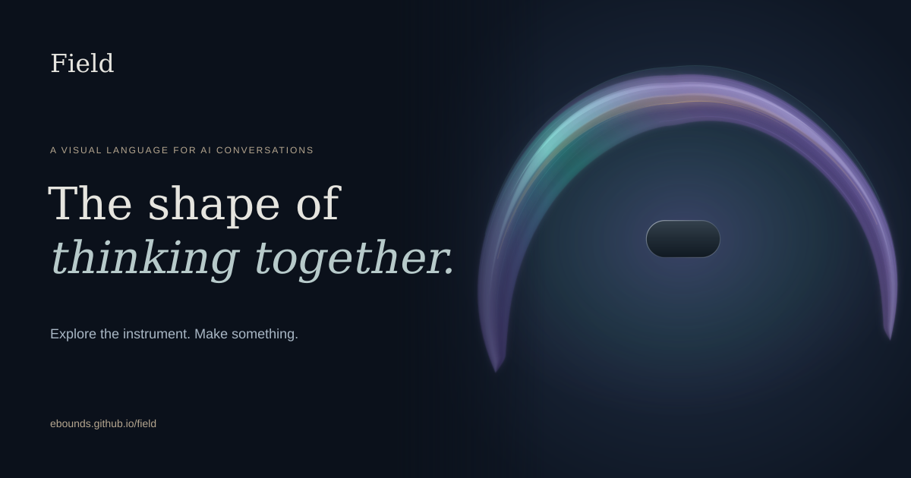
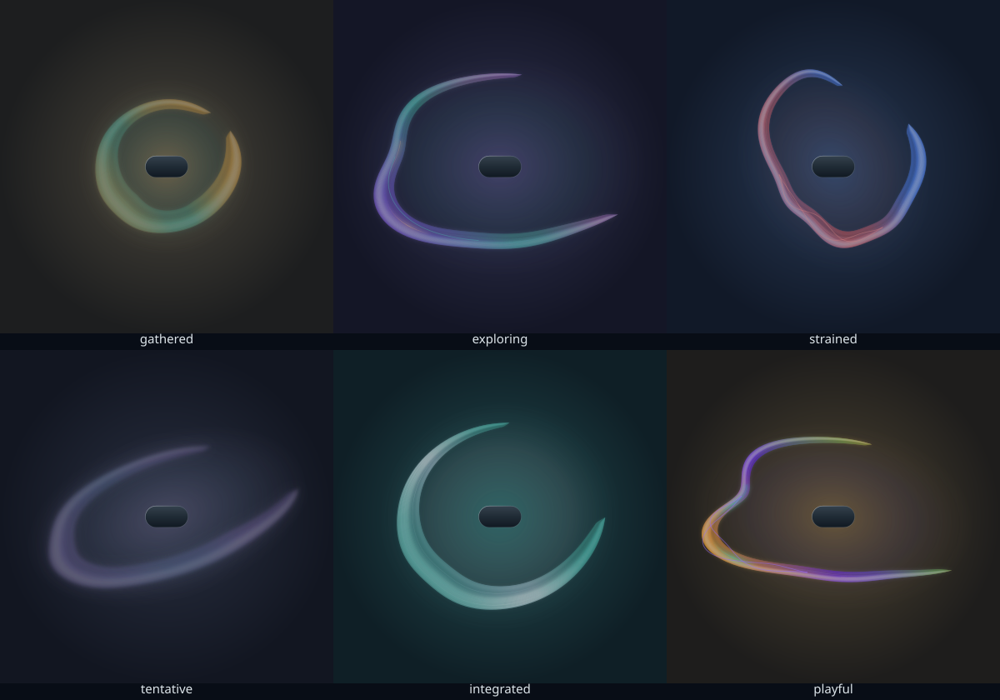

# Field

**The shape of thinking together.**

A visual language for the accumulated tone of an AI conversation: attention, imagination, care, uncertainty, and tension, held in a wordless work of art.

[**Try the companion →**](https://ebounds.github.io/field/companion.html) · [Visual playground](https://ebounds.github.io/field/) · [Download Field 4.5.1](https://ebounds.github.io/field/downloads/field-4.5.1.zip) · [Illustrated reading guide](https://ebounds.github.io/field/field-guide.pdf)

[](https://ebounds.github.io/field/)

Field asks an assistant: **“What has it been like to think with me through this whole conversation, as expressed now?”**

The assistant reads the available exchange, forms a brief composition score, and chooses drawing controls under a shared visual grammar. A fixed titanium capsule anchors the image. Around it, a translucent field gathers, sweeps, folds, and rejoins.

Field offers an interpretation of the conversation and the assistant's way of engaging with it, using the fullest context and reflective understanding its host permits. It makes no claim to directly measure internal state or answer quality. Its usefulness is open to experimentation.

## Try it now

The [browser playground](https://ebounds.github.io/field/) has six starting studies, live controls, SVG and PNG downloads, and links that recreate a composition. Open **Listen to this field** for its optional musical companion, with volume, stop, and stereo WAV export. It runs in your browser with no account or API key. You can also paste Field v4 JSON controls chosen by an assistant. Shared links stay silent until the recipient presses Listen.

## New in 4.5: a conversation, held

[Field Companion](https://ebounds.github.io/field/companion.html) gives the expression somewhere to stay. It moves between authored compositions, carries an actual earlier contour into the present field, and restores a selected conversation after a pause. Open **Small window** for a companion beside your chat. Still view, reduced motion, recent-history replay, source and coverage inspection, SVG/history export, and optional listening are included.

The public companion presents a clearly labeled scripted study. For your own conversation, unzip the package and start the local service with **Node.js 18+**, without extra dependencies:

```bash
node scripts/field.mjs serve
```

Open the local address it prints, then ask your assistant:

> Read the Field skill and its continuity protocol. Keep Field present for this conversation. After substantive responses or meaningful work milestones, publish an updated expression using the fullest context and reflective understanding your host permits. Preserve the whole-conversation scope and describe any material gaps.

The participating agent composes and publishes updates through the bundled command. Starting the service alone does not monitor a chat or call a model. Your host must support running that command and carrying the instruction across turns. Expressions and an optional phase index stay in a local `.field` directory; restart with the same directory to resume. The interface shows when its expression was last published, including during disconnection.

Read [how to connect](https://ebounds.github.io/field/continuity.html), the [agent protocol](references/continuity-protocol.md), or the [4.5 design note](docs/field-4.5-design.md). Listening plays a complete 24-second portrait of the moment selected when you press Listen. The visual can advance while that phrase finishes; the panel identifies which moment is being heard. Stop and listen again for the moment now in view. Ongoing music that evolves across moments is a future experiment.

## Listening: the same field, given time

Field 4.4 adds a 24-second musical expression around a steady tonal center. The palette becomes a family of related sound materials: wood, clear tones, suspended glass, felt, bowed tension, and open harmonics. Voices gather, reach, answer, and leave a softened trace. Each phrase ends in silence.

Image and sound use the same whole-conversation interpretation and controls. The audio is synthesized locally, without samples or a music service. It can accompany a visual or be requested on its own. An ordinary Field invocation remains visual.

> Make a Field of our whole available conversation, and include its listening companion.

The portable audio renderer needs **Node.js 18+**, with no dependencies:

```bash
node scripts/render_audio.mjs --spec controls.json --output field.wav
```

The output is stereo, 44.1 kHz, 16-bit WAV with the public Field controls embedded. The browser and command line use one audio implementation. The [listening grammar](references/listening-grammar.md) explains the musical conventions; the [4.4 design note](docs/field-4.4-design.md) describes the intent and open questions.

## Use Field in a conversation

1. [Download Field 4.5.1](https://ebounds.github.io/field/downloads/field-4.5.1.zip) and unzip it, or clone this repository.
2. Give the package to an assistant that can read files and run Python.
3. In an existing conversation, ask:

> Read the Field skill in the attached package, including its references. Use the supplied renderer to express the accumulated tone of our whole available conversation as one wordless Field visual.

Keep the complete package together, including `docs/site/` for optional audio. The visual renderer uses Python's standard library. See the [quick start](docs/quickstart.md) for other ways to use the package.

```bash
python3 scripts/render_field.py --spec controls.json --output field.svg
```

Omit `--spec` to draw the default field. Open the SVG in a browser or any SVG viewer.

## The visual language

Revision 4.3 offers three connected forms: an **envelope** gathers around the center, a **sweep** carries an open direction, and a **mantle** holds tall space. A retained trace can carry an earlier influence; a joined countercurrent can hold a second quality alongside the first.

Color has a shared convention. Teal suggests attention; blue, analytical composure; violet, imagination; amber, care; coral, live tension; pearl, integration. Geometry expresses how those qualities are held. A private composition score connects the whole-conversation reading to the drawing choices.

[](https://ebounds.github.io/field/#playground)

Read the [visual grammar](references/visual-grammar.md), [composition score](references/composition-score.md), [whole-conversation synthesis](references/conversation-synthesis.md), or [4.3 design note and research](docs/field-4.3-design.md).

## Develop or contribute

Start with the [project handoff](docs/project-handoff.md) for the goals, major decisions, implementation map, current limitations, and questions for an independent review.

The Python renderer is the reference implementation. The browser renderer mirrors it and is checked against it:

```bash
python3 scripts/check_browser_renderer.py
```

That check requires Node.js. To rebuild reference art and public downloads:

```bash
python3 scripts/build_reference_assets.py
python3 scripts/build_public_assets.py
```

Check the audio instrument with `node scripts/check_audio.mjs`. Run real browser checks (including opt-in playback, cancellation, WAV export, and phone layouts) with `CHROME_BIN=/path/to/chromium node scripts/check_public_site.mjs http://127.0.0.1:8080/` after starting the local server below. Audio correctness checks cover samples and playback behavior; artistic judgment still needs listening.

Check the companion's contract, local service, persistence, and conversation isolation with `node scripts/check_continuity.mjs`. Run its browser checks with `CHROME_BIN=/path/to/chromium node scripts/check_companion_browser.mjs http://127.0.0.1:8080/`. That test also starts an isolated temporary companion to exercise live publication and reconnection.

Serve the demo locally with `python3 -m http.server 8080 --directory docs`. The site is static HTML, CSS, and JavaScript. GitHub Pages publishes `docs/` from `main`.

The [guide builder](docs/build_field_guide.py) requires ReportLab, Pillow, Cairo, librsvg, and Liberation fonts. The social card source is `docs/site/social-card.svg`; rasterize it at 1200 × 630 after changing the artwork.

Share an artwork, an interpretation, a rendering issue, or a proposed improvement in [Issues](https://github.com/ebounds/field/issues). Particularly useful comparisons keep the same ending while changing earlier phases of a conversation, or distinguish warm agreement from warm disagreement.

Created by [Edgar Bounds](https://github.com/ebounds). Released under the [MIT license](LICENSE).
