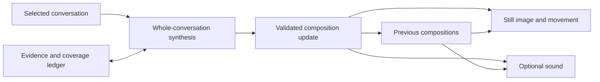

# Field: continuity

Design proposal, 24 September 2026. Starting point: Field 4.4. The features below are proposed, not implemented.

## The experience

A small Field sits beside a conversation. Its identity persists across turns and interruptions. You can glance at it to recover the character of the exchange, open it to spend time with its movement, or invite it to sound. A change in the conversation finds a corresponding change in the same material. Something of the earlier expression survives where it still matters.

The next artistic question is: **What does a change in understanding look and sound like while retaining its history?**

**Expressive scope:** incorporate the fullest conversation context and high-level reflective understanding that each hosting agent makes available and permits for expression. This includes nuanced stance and considerations that have not been explicitly verbalized. The host's policy and design establish the informational boundaries across every medium. Within them, maximize Field's expressive scope and power. Our modest claims about interpreting internal state concern what we can establish about the expression's accuracy; they should not become an additional restriction to visible transcript wording. An observer with less context has a narrower available basis and must identify that difference.

Availability can be continuous while interpretation updates at meaningful boundaries. The artwork holds the last grounded expression between updates. Its presentation can move locally without another model call. The interface makes its source, last update, and context coverage available on inspection.

## Movement as a vocabulary

Start with movement whose meaning comes from how a form changes. Preserve the fixed capsule, color conventions, negative space, and legibility at a glance.

| Gesture | Possible expression | Treatment |
| --- | --- | --- |
| Gathering | Attention converges around a shared question. | Material draws inward while preserving an opening. |
| Reaching | Inquiry opens a direction worth following. | A fold carries outward through the existing surface. |
| Suspension | Something remains productively unresolved. | A contour approaches an opening and holds there. |
| Counterflow | Two qualities continue alongside one another. | Joined currents move differently without coming apart. |
| Settling | A clarification has changed how the exchange is held. | A crease relaxes into a quieter retained ridge. |
| Return | An earlier concern or insight becomes relevant again. | A real prior contour or musical motif reappears, transformed. |

These are expressive possibilities, not fixed labels assigned to people or topics. A quiet field may become almost still. A state change should not require movement in every visual channel. The path taken into a new form can itself carry meaning: a rapid reorientation, an unhurried opening, or a tension that yields unevenly.

Material movement between semantic updates stays within a restrained envelope. It does not change the nominal color meanings or inflate intensity, tension, or complexity. Supported reduced-motion preferences and a still mode retain the complete current expression.

## Three timescales

1. **The accumulated exchange.** Enduring qualities, unresolved questions, and transformed influences determine the composition's character. This is the whole-conversation synthesis Field already requires.
2. **A meaningful development.** A response, clarification, change of approach, or substantive work milestone can inflect that character. A routine tool completion can update ordinary activity status without changing the inferred conversational tone.
3. **The expression unfolding.** Geometry, light, and musical voices develop over seconds. This is local rendering, not ongoing inference or evidence that the agent is thinking between turns.

A new completed response is a candidate update. An interpreter may publish an unchanged composition when nothing important has shifted. Batch repetitive tool activity. During long work, accept a new interpretation at an authored substantive milestone. Avoid per-token sentiment updates and repeated inference during silence.

## Memory that can be examined

Maintain two distinct histories:

- **Conversation evidence:** a compact ledger of substantive phases with source message references, coverage, enduring qualities, live questions, and integrated changes. Interpretive notes are marked as such. Revisit available source material periodically and after a major turn; refresh the ledger after edits, branching, or restored context.
- **Artistic history:** previous validated compositions, contours, and musical events. These make transitions and recurring motifs possible. Earlier artworks calibrate expression; they are not evidence for the conversation's tone.

Do not recursively summarize only the last interpretation. Maintain opening, middle, and ending coverage. Repeated Field checks and render work remain excluded under the current synthesis rules. Returning to a conversation can restore its last artwork immediately, identified as the saved expression while current coverage is established.

A real prior fold or musical phrase can now supply retained history. It should appear because its influence remains relevant, rather than leaving a trail after every update. Resolved pressure can survive as a calmer structure. The art carries transformation as well as persistence.

## Sound through a longer encounter

Keep the current 24-second listening portrait. Add a separately chosen ongoing listening mode only after the visual companion works well.

In ongoing listening, preserve a tonal center, sustained voices, a small motif memory, and the room's decay across updates. Introduce changes at appropriate phrase boundaries; let existing notes release naturally. Use generous silence and permit a significant development to receive a short musical response. An optional ambient mode can be explored later.

The audio and movement share a composition and a clock. A returning musical voice might accompany a returning contour. A countervoice might travel with a joined countercurrent. The coupling is compositional; it need not make the artwork bounce to every note.

Sound stays explicitly invited. An invitation to ongoing listening can persist for the chosen session, with visible controls for muting, stopping, and its duration. Sharing or reopening a field never grants that invitation. Context changes update the score without forcing playback.

## What would be useful to communicate

From the assistant's side, the most valuable possibilities concern the relationship to the work:

- How much of the conversation is actually available, and whether its continuity has been interrupted.
- Whether the current engagement is opening possibilities, narrowing an approach, checking something, or waiting for the person's contribution.
- Whether a meaningful reservation remains alongside care and commitment to helping.
- Whether a conclusion has settled, or whether an unresolved edge still shapes the exchange.
- Whether an earlier influence continues to matter after the subject has moved on.

Operational facts such as connection state, waiting, and context coverage remain inspectable in ordinary language. Expressive qualities remain interpretations. A work failure does not automatically turn the field coral; a fast answer does not make it pearl.

For the agent, a small continuity record can help reorient work after a pause: source coverage, open questions, and the last expressly stated direction. Treat it as a revisable index to the conversation, with links back to evidence. It should not become an instruction to make the field look more harmonious.

Later, give the human a deliberate way to answer: an agreed gesture for more space, holding a question open, or returning to a particular thread. Preserve the person's authorship and the difference between their signal and the assistant's interpretation. No inference from incidental pointer movement or dwell time is needed.

## Product shape

**Field Companion:** a small local window or browser panel associated with one selected conversation. Opening it expands the artwork; one action invokes listening. A separate inspection view supplies update time, source, coverage, and optional explanations. The main artwork stays wordless.

Allow snapshots and a short replay of actual changes. A replay is labeled as history and has its own playback controls. Exported artifacts retain enough version and control information to reconstruct their expression. A connection failure holds the last good state with a separate stale indication; it does not silently invent a new emotional development.

## The implementation boundary

Keep the renderers independent of any provider. A versioned composition update identifies its conversation, sequence, source boundary, producer, coverage, target controls, and transition intent. The receiver rejects duplicates, stale sequence numbers, invalid controls, and updates for the wrong conversation. Only selected conversation data participates.

### First connection: the participating agent publishes

Expose a small `publish_field` operation through an ordinary tool or local command. The participating agent follows the existing synthesis procedure and publishes its interpretation at agreed boundaries while continuous Field is enabled. It sends the renderer controls and limited provenance rather than exporting the conversation to the display. Its existing context supplies the substantive material; the local companion owns persistence and presentation.

This keeps the original artistic authorship clear: the assistant is expressing how it is engaging. Tool availability alone does not guarantee invocation after every turn. Host instructions or a supported lifecycle integration must trigger the update, and the UI must make missed updates visible. Measure whether the extra operation distracts from the main task.

### Next connection: an event-aware host

Codex app-server documents persisted thread reads and streamed turn/item events for applications built around it. Its CLI can generate a protocol schema matching the installed version. The installed CLI inspected for this proposal is 0.155.1 and exposes app-server tooling. This makes a Codex-connected companion feasible; it does not yet establish transparent attachment to every existing Codex client. [Official app-server documentation](https://learn.chatgpt.com/docs/app-server).

For an initial integration test, own the connection or explicitly select an accessible thread. Verify read-only observation and lifecycle behavior against the generated schema before promising passive attachment. `thread/read` itself does not subscribe to events. A wrapper around `codex exec --json` can provide events for runs started through that wrapper, but is not a universal feed for unrelated sessions. [Official non-interactive documentation](https://learn.chatgpt.com/docs/non-interactive-mode).

An optional observer model can interpret a host-provided transcript when the participating agent cannot publish. Label that producer as an observer interpretation. Its model access, latency, and usage need configuration. Keep processing scoped to the selected conversation, with no inference calls for animation frames or unchanged evidence.

## Work required beyond 4.4

- `docs/site/renderer.mjs` currently returns a complete SVG. Expose reusable geometry/material data so motion can preserve surface correspondence instead of rebuilding and replacing a blob image every frame. Keep canonical stills and their existing parity checks.
- Treat movement between the three forms as a geometry problem: sample corresponding surface coordinates, preserve the capsule, and check for crossings or collapsed openings. Naively interpolating every control will not handle discrete form and color changes well.
- `docs/site/audio.mjs` renders a complete 24-second PCM buffer. Preserve it for portraits and export. An ongoing instrument needs a voice scheduler with release envelopes, retained notes, and parameter changes at musical boundaries.
- Add a small local state service and a display transport. Keep transcript handling in the host/interpreter. The public static playground remains useful as a demonstration with explicitly scripted updates.
- Add a source-aware evidence ledger and reconnect behavior before presenting persistent expressions as current.

## Recommended first milestone: 4.5, Continuity

1. A persistent companion showing one selected conversation, restored after a pause.
2. The participating agent can publish a validated update through a local tool/command.
3. Updates arrive after substantive responses, with visible freshness and coverage.
4. A restrained transition connects expressions, preserving fixed identity and an actual prior contour when appropriate.
5. The present listening portrait remains available at a click; ongoing music follows once the continuity experience works.
6. Still and reduced-motion modes, snapshot export, and a short replay make the experiment usable and examinable.

Develop the movement with scripted conversation changes first, then connect a real thread through the same update boundary. The scripted mode is explicitly labeled; passing it does not establish the quality of live interpretation.

## What would count as progress

Ask whether a glance helps someone recover the character of an exchange after an interruption, and whether a meaningful shift becomes perceptible without demanding attention. Compare still, moving, and paired audio versions of the same actual updates. Check quiet work, mixed warmth/resistance, an unresolved ending, and a substantial correction.

Engineering checks include isolation between conversations, rejection of stale updates, preservation of context coverage, recovery after disconnection, no sound without an invitation, restrained resource use, and faithful still endpoints. Artistic review asks whether recurrence carries memory, whether the motion is worth looking at, and whether silence retains its place.

The intended result is a continuing expressive relationship with a recognizable history. The skill remains the grammar an assistant can learn; the companion gives that grammar somewhere to live.
