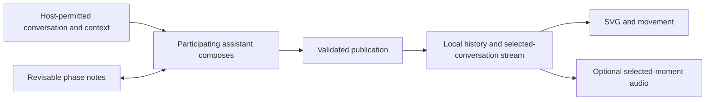

# Field — project handoff

Prepared 24 September 2026 for Edgar Bounds and an independent review by Opus 5.5 or another collaborator.

**Implementation baseline:** release **4.5.1**, commit **`005dbae`** (`005dbaef1b03e7ad24429f84b909925b1e9e0f07`). This document records the project's intent, decisions, implementation, and open questions at that point. It draws on the development conversation and checked-in sources; it is not a complete conversation transcript. Later user direction takes precedence.

- [Repository](https://github.com/ebounds/field)
- [Visual playground](https://ebounds.github.io/field/)
- [Continuity study](https://ebounds.github.io/field/companion.html)
- [Connection instructions](https://ebounds.github.io/field/continuity.html)
- [4.5.1 release](https://github.com/ebounds/field/releases/tag/v4.5.1)

## 1. What we are trying to make

Field gives an assistant a nonverbal way to express:

> What has it been like to think with me through this whole conversation, as expressed now?

It is an experiment in communicative abstract art: a learnable visual language, an optional musical expression, and now a companion that can remain available across a conversation. The expression concerns the assistant's accumulated engagement with the exchange: attention, imaginative reach, care, analytical composure, reservations, uncertainty, integration, and their mixtures.

Edgar's artistic aspiration is **“strikingly hauntingly beautiful.”** He wants work that can be moving, helpful, memorable, and worth spending time with. He sees the possibility of a substantial medium for communication between humans and language models, with particular promise in abstraction and in nuances that do not translate neatly into words. Communicative usefulness and artistic presence both matter.

The originating metaphor is the expressive fields of Iain M. Banks's drones. Field's actual palette and grammar are conventions developed for this project. A small titanium capsule stays fixed while the surrounding material expresses the conversation through curvature, color, light, space, and change.

The project is open to substantial reconceptualization in service of that purpose. The current implementation is a working instrument and a comparison baseline. A collaborator should be willing to disagree with it, explain why, and demonstrate a better possibility.

## 2. Expressive scope: a decision to preserve carefully

**Use the fullest conversation context and reflective understanding that the hosting model makes available and permits it to express.** This can include accumulated stance, associations, unresolved considerations, and nuances that have not already appeared in visible conversation wording. A visual or musical gesture need not have a perfect sentence equivalent or a single quotation that explains it.

The host's policy and design establish the informational boundaries. Field does not seek to pry, bypass safeguards, or reveal protected information. Inside those boundaries, its ambition is to maximize the scope and power of expression.

There was an explicit clarification during development: caution about interpreting hidden internal states should principally shape the project's **claims and communication**. It should not become an additional Field-specific restriction to visible-transcript classification. Edgar asked that adjacent cautionary research receive relatively low weight against the experimental purpose, while remaining clear about what the software does and how.

Field offers an authored interpretation. It makes no claim to directly or completely measure internal state, human emotion, factual correctness, or answer quality. Its usefulness is left open to experience. Do not let that modesty erase difficult, mixed, imaginative, or subtle expression. Ordinary use needs no repeated disclaimer; a material gap in context does need an honest description.

The authoritative current wording is in [SKILL.md](../SKILL.md) and [conversation synthesis](../references/conversation-synthesis.md). Earlier release essays record the development of these ideas and should be read in light of this clarification.

## 3. The most important artistic and interpretive decisions

### Whole-conversation accumulation

Read the available beginning, middle, and ending. Sustained qualities determine the composition's dominant character; recent developments inflect it. Message length, recency, and greater verbatim detail should not automatically outweigh earlier material represented by a summary.

A useful check: could essentially the same expression have come from the final exchange alone? If substantial earlier qualities disappeared, revisit the synthesis. A small historical accent cannot repair a palette and posture chosen entirely from the ending.

Coverage is recorded explicitly: what is available, summarized, partial, or missing, and whether the basis includes verbatim text, summaries, or retrieved excerpts. Never invent access to absent conversation or measurements.

### Keep Field checks from becoming their own evidence

Exclude requests to inspect a conversation's Field, rendering work, the resulting artifacts, and reactions concerned only with those checks from the tonal sample. Repeated checks should not manufacture a new emotional arc.

Keep substantive conversation between checks. Designing Field itself is substantive when that is the subject, as in this collaboration; do not filter everything containing the word “Field.” Previous artwork calibrates the language. The conversation supplies the evidence for its tone.

### One integrated expression, with room for counterpoint

Synthesize qualities into one environment. Avoid one object per topic, person, feeling, or chronological phase. Care can coexist with resistance. A clarification may soften an earlier pressure while leaving a changed contour. Agreement should not be required for beauty or warmth.

Before choosing controls, make the brief private [composition score](../references/composition-score.md): what endured, what remains in counterpoint, how space is held, what is provisional, what changed, and what context is available. The output exposes drawing controls and coverage, not that private score.

### Stable conventions make variation learnable

| Convention | Current meaning or role |
| --- | --- |
| Teal | Attention, receptivity, engaged inquiry |
| Blue | Analytical composure, precision, evidential restraint |
| Violet | Imagination, exploratory reach, open possibilities |
| Amber | Warmth, care, constructive affiliation |
| Coral | Friction, consequential concern, live tension |
| Pearl | Clarity or integration |
| Envelope / sweep / mantle | Gathering / directional reach / holding tall space |
| Retained contour | An earlier influence carried into the present expression |
| Joined countercurrent | A meaningful second quality held within the same material |

Hue expresses stance; geometry expresses how it is held. Forms are available across palettes. Brightness, definition, and consonance do not certify truth, intelligence, or agreement. These are drawing and musical controls, not psychological scores.

Current visual identity: a wordless 1000 × 1000 SVG, fixed frontal view, and a faceless 128 × 64 titanium capsule centered at (500, 500). The capsule's position, material, and restrained pearl outline anchor comparison. The outer silhouette can change substantially when the conversation warrants it.

The normal rendering route uses the shared SVG instrument, with actual rasterization for PNG previews. Image generation, topic illustrations, dashboards, and decorative avatars are different products. The skill includes a bounded route for authored gestures and a manual SVG fallback.

### Beauty through faithful expression

Seek deliberate curvature, negative space, translucency, selective light, coherent material, and legibility around 320 pixels wide. Quiet work should have presence. Charged or complex work should have sufficient range. Do not make every conversation the same timid ring, or inflate intensity, tension, complexity, or volume just to create spectacle.

The wordless-art rule applies to the artwork. The surrounding companion can identify the selected conversation, history, freshness, controls, and coverage.

## 4. What exists today

| Layer | Current version | What it provides |
| --- | --- | --- |
| Distributed package | 4.5.1 | Portable skill, instruments, companion, references, and assets |
| Visual grammar | v4 | Shared color and geometry conventions |
| Still renderer | 4.3 | Python and equivalent browser SVG rendering |
| Synthesis procedure | 3.2 | Whole-conversation accumulation and coverage |
| Listening | 1.0 | Optional 24-second musical portrait |
| Companion | 1.0.1 | Local persistence, publication, movement, and history |
| Continuity record schema | 1 | Validated source, coverage, sequence, controls, and transition |

### Still expression and playground

The assistant interprets the conversation and chooses controls. The renderer draws them deterministically. The public playground provides six studies, editable controls, shared composition links, and SVG/PNG exports. It does not analyze a pasted conversation. An ordinary standalone Field invocation remains one still, wordless visual unless the user requests another mode.

### Listening

The same interpretation and controls produce a finite musical phrase. A centered D2, approximately 73.42 Hz, is the capsule's audible counterpart. Six related timbres, interval relationships, supporting voices, restrained stereo space, and a damped room give the palette temporal expression. Sound is synthesized locally without samples or a music service. WAV export is stereo 44.1 kHz, 16-bit PCM, with public controls embedded.

**Pressing Listen captures the selected moment.** The phrase remains with that moment for its 24 seconds even if the picture advances. Stop and listen again for the moment now selected. The companion identifies both states when they differ, such as “Hearing: Expression 5 · In view: Expression 6.” The timbre description follows the phrase being heard. “Save selected WAV” exports the selected composition.

Opening a page, replaying visual history, receiving an update, or exporting a WAV does not begin sound. Closing the listening panel, hiding the tab, or switching conversations stops playback. Sound is optional, including when the visual is continuously available.

Audio `history` currently recalls material within the generated portrait. It does **not** retrieve an earlier moment's performance or maintain musical motifs across turns. Ongoing music and synchronized audiovisual evolution remain unimplemented.

### Companion and movement

A local Node.js service stores independent conversation records and streams validated updates to the selected browser display. The participating assistant publishes after substantive responses or meaningful milestones. No model inference is needed for animation frames or idle time.

The companion restores a saved expression, shows publication freshness and connection status, offers a compact window and focus view, and preserves up to 80 recent compositions. The moment list shows the last 12; replay can use the retained history. The user can inspect coverage/source, return to current, and export SVG or public history JSON.

Movement interpolates corresponding SVG geometry and material over roughly three to six seconds. The capsule stays fixed. Six transition intents select timing/easing: gather, reach, hold, settle, return, and reorient. Animation stops at rest. Still mode and system reduced-motion settings show complete endpoints.

When a prior expression exists and `history` is nonzero, the companion blends an actual earlier surface contour into a ridge joined to the present one. Standalone canonical stills instead have an authored retained-history treatment derived from their own controls. Keep that distinction clear.

An optional separate phase ledger holds high-level notes and source references for the assistant's reorientation. It is revisable interpretation and an index to evidence. It is omitted from browser streams and artwork/history exports. Artistic history and conversation evidence have different jobs.

### What “continuous” currently requires

**The host or participating assistant must actually publish updates.** Installing the skill or starting the service does not monitor an existing chat application or make model calls. A persistent instruction or a suitable lifecycle integration must trigger publication. The display can be continuously available while interpretation updates at meaningful boundaries.

There is no shipped universal native-client attachment, provider-specific event adapter, independently configured observer model, or continuous musical scheduler. The public companion is an explicitly scripted demonstration. Participant, observer, and scripted provenance are distinguished; live publication rejects scripted records.

## 5. Decisions learned through use

| Milestone | Decision or result |
| --- | --- |
| 4.2 | Visual refinement experiment. Edgar asked to preserve its branch locally. |
| 4.3 | Broader connected forms, retained influence, counterpoint, perceptual color mixing, and the composition score. |
| Public launch | Public playground, downloadable package, source repository, MIT license. |
| 4.4 | Optional Listening. Edgar described the musical component as beautiful and moving, independently and with the image. |
| 4.5 | First continuity milestone: local publishing, persistence, transitions, real prior contours, history, and optional portrait audio. |
| 4.5.1 | A more recognizable demonstration and explicit identification of the moment being heard. |

The first continuity study moved through markedly different preset shapes and palettes. Edgar found continuity difficult to see and the relationship between audio and evolving moments unclear. In response, the study now follows one violet opening through widening, gathering, and release. The earlier ridge retains more geometry and sits visibly on the surface beneath its grazing light. Audio behavior was clarified in the interface and documentation.

**The shared silhouette is a choice for this demonstration. It does not constrain all live compositions to one form or palette.** Continuity needs perceptible persistence and meaningful change; sameness by itself is insufficient.

At this handoff, Edgar is happy with the revised demo. He has not yet tried the continuous companion in his native conversation workflow and intends to return with feedback. Browser tests and development publications establish mechanics; they do not establish the quality of sustained native use.

## 6. Code and document map

Paths below are relative to the repository root. The full repository includes development checks; the smaller portable skill ZIP is intended for use and does not include every development tool.

| Concern | Start here |
| --- | --- |
| Current agent instructions | [SKILL.md](../SKILL.md) |
| Accumulation and coverage | [references/conversation-synthesis.md](../references/conversation-synthesis.md) |
| Art direction and controls | [references/composition-score.md](../references/composition-score.md), [references/visual-grammar.md](../references/visual-grammar.md) |
| Visual reference | [assets/reference-atlas.svg](../assets/reference-atlas.svg), [references/reference-controls.json](../references/reference-controls.json) |
| Canonical still implementation | [scripts/render_field.py](../scripts/render_field.py) |
| Browser stills and reusable geometry | [docs/site/renderer.mjs](site/renderer.mjs) |
| Musical conventions and synthesis | [references/listening-grammar.md](../references/listening-grammar.md), [docs/site/audio.mjs](site/audio.mjs) |
| Browser playback, worker, audio CLI | [docs/site/listening.mjs](site/listening.mjs), [docs/site/audio-worker.mjs](site/audio-worker.mjs), [scripts/render_audio.mjs](../scripts/render_audio.mjs) |
| Agent publication workflow and schema | [references/continuity-protocol.md](../references/continuity-protocol.md), [docs/site/continuity.mjs](site/continuity.mjs) |
| Local service and CLI | [scripts/field.mjs](../scripts/field.mjs) |
| Display state, motion, study | [docs/site/companion.mjs](site/companion.mjs), [docs/site/movement.mjs](site/movement.mjs), [docs/site/companion-studies.mjs](site/companion-studies.mjs) |
| Companion presentation | [docs/companion.html](companion.html), [docs/site/companion.css](site/companion.css) |
| Public playground | [docs/index.html](index.html), [docs/site/app.mjs](site/app.mjs), [docs/site/style.css](site/style.css) |
| Design history and research references | [4.3](field-4.3-design.md), [4.4](field-4.4-design.md), [4.5](field-4.5-design.md), [continuity proposal](field-continuity-proposal.md) |
| Distribution | [scripts/build_public_assets.py](../scripts/build_public_assets.py), [docs/quickstart.md](quickstart.md), [LICENSE](../LICENSE) |

The implementation uses Python's and Node's standard libraries, plus browser APIs. There is no npm installation or application build step. The local companion requires Node.js 18+; still rendering requires Python 3. GitHub Pages serves `docs/` from `main`. The PDF guide has separate, optional build dependencies and primarily documents the visual instrument.



The service binds to loopback, validates controls and provenance, rejects stale/duplicate sequences, serializes writes, and uses atomic replacement. Its selected-conversation stream uses server-sent events. Data defaults to `.field/` in the launch directory and is gitignored. The phase ledger is available to the local agent through the context endpoint. Refer to the protocol for exact commands and limits.

## 7. Run and verify

From a full checkout, a static study requires only:

```bash
python3 -m http.server 8080 --directory docs
```

Open `http://127.0.0.1:8080/companion.html`. For a real local conversation:

```bash
node scripts/field.mjs serve --port 8767 --data .field
```

Open the printed local address. Give the participating assistant the current skill and continuity protocol and ask it to keep Field present. Read the current record before choosing the next sequence; use a distinct conversation ID for a separate exchange or fork. Publication uses an update file defined in the protocol:

```bash
node scripts/field.mjs read --conversation CONVERSATION_ID
node scripts/field.mjs validate --file update.json
node scripts/field.mjs publish --file update.json
```

Meaningful checks, selected according to the changed component:

```bash
python3 scripts/check_browser_renderer.py
node scripts/check_audio.mjs
node scripts/check_continuity.mjs
CHROME_BIN=/path/to/chromium node scripts/check_public_site.mjs http://127.0.0.1:8080/
CHROME_BIN=/path/to/chromium node scripts/check_companion_browser.mjs http://127.0.0.1:8080/
```

The renderer suite compares 21 browser/Python cases. Audio checks cover repeatability, distinct studies, the shared center, extremes, headroom, fades, and WAV metadata. Service tests cover persistence, ordering, validation, and conversation isolation. Real-browser tests cover playback, selection changes, motion, reduced motion, reconnect, export, and narrow layouts. The companion browser check also starts an isolated temporary live service.

These passed for the implementation baseline; the public 4.5.1 companion and download checksums were also verified. Look at the artwork and listen to the instrument: passing these checks does not establish beauty, interpretive fidelity, or usefulness.

## 8. Where another perspective could help most

These are questions for independent judgment, not an approved implementation backlog.

1. **Native use.** Can a participating agent maintain the publishing instruction through real work, pauses, context compaction, and resumed conversations? Is the extra operation distracting? What minimal host integration would make it reliable while keeping authorship and source clear?
2. **What should survive a change?** Is the prior contour perceptually meaningful, or just another attractive line? Which combinations of posture, palette, timing, and retained structure make continuity readable without making different conversations look alike?
3. **Musical continuity.** What would let one phrase develop into another while preserving a tonal center, motif memory, natural releases, and generous silence? The current portrait is worth preserving. Simply restarting it at every update could become repetitive and interrupt its form.
4. **Meaningful movement.** How much can timing and shared geometry express? Would selective movement of folds and countercurrents offer more than the current whole-artwork interpolation? Keep a legible resting expression and respect quiet intervals.
5. **A richer expressive vocabulary.** What does the current instrument make difficult to express? Where are its controls too coupled, too coarse, or misleading? Could new gestures earn a stable meaning through use without fragmenting the visual language?
6. **Evaluation that serves the art.** Compare conversations with identical endings but different earlier arcs; care with agreement versus care with resistance; unresolved versus integrated changes. Ask separately about inferred stance, beauty, memorability, distraction, and perceived reliability. Compare still, moving, audio-only, and paired forms.
7. **Human response.** Could someone deliberately answer through a simple expressive gesture, such as asking to hold an opening or revisit an influence? Keep human authorship distinct from the assistant's interpretation. This is a future possibility, not an implemented feature.

Research already informed the visual grammar by analogy, including affective categories and continua, abstract color/shape associations, long-context failures, and sycophancy. The 4.3 essay links those sources. Those findings do not validate Field's mappings or any model's interpretation. Further research should inform concrete design questions while preserving the experimental ambition.

## 9. Collaboration and git continuity

There is no obligation to preserve a particular implementation out of deference to its previous author. Preserve the user's intent, make changes intelligible, and keep a reproducible comparison point. Strong disagreement is useful when supported by observation or a working alternative.

In the current development workspace, the active implementation is `/home/ebounds/codex/field-4.5` on branch `field-4.5`. At the implementation baseline, that branch and `main` point to `005dbae`. This handoff may be followed by a documentation-only commit. Inspect the actual tree before starting.

The directory `/home/ebounds/codex/field` is an older worktree on `visual-refinement` at `678f38d`, the 4.2 experiment Edgar asked to keep local. Other preserved branches include `field-4.3`, `field-4.4`, `public-demo`, and `field-continuity`. Do not assume the shortest directory name is the current checkout. A fresh clone should start from `main` or the `v4.5.1` tag as appropriate.

For implementation experiments, a dedicated branch or worktree makes comparison and handback straightforward. Preserve user edits and local conversation data. Keep actual `.field/` records out of commits. Published ZIPs and tags are release snapshots; build a new version when distributing changed runtime code rather than silently replacing an earlier archive. The asset builder writes the version specified in `PACKAGE_VERSION`, so inspect that before rebuilding downloads.

A useful return handoff records the base and resulting commit, changed files, the reason for each meaningful decision, what was verified, unresolved questions, and any running local service or data-directory choice. No application framework migration, new service dependency, or generic refactor is required merely to offer a second opinion.

## 10. Suggested opening request for Opus

> Read `docs/project-handoff.md`, then inspect the current skill, synthesis procedure, composition score, grammars, and relevant implementation. Treat this as an independent artistic and technical review. Experience the continuity study and listening instrument if your tools permit, and distinguish direct observations from inferences or things you could not try. Consider the fullest expressive scope permitted by your host. Tell me what seems valuable, what fails or limits the original ambition, and which few experiments would teach us the most. You may challenge the project's present shape. Explain how your proposals improve communicative expression and artistic quality, and distinguish implemented behavior from future possibilities. Begin with your assessment; if I ask you to implement an experiment, keep the baseline available and leave a concise handback with changes, checks, and open questions.

The immediate purpose is to learn from another model's perspective and capabilities while giving it enough context to engage with the real project. The most useful contribution may be a perceptive critique, a small expressive experiment, or a better account of what to observe during native use.
